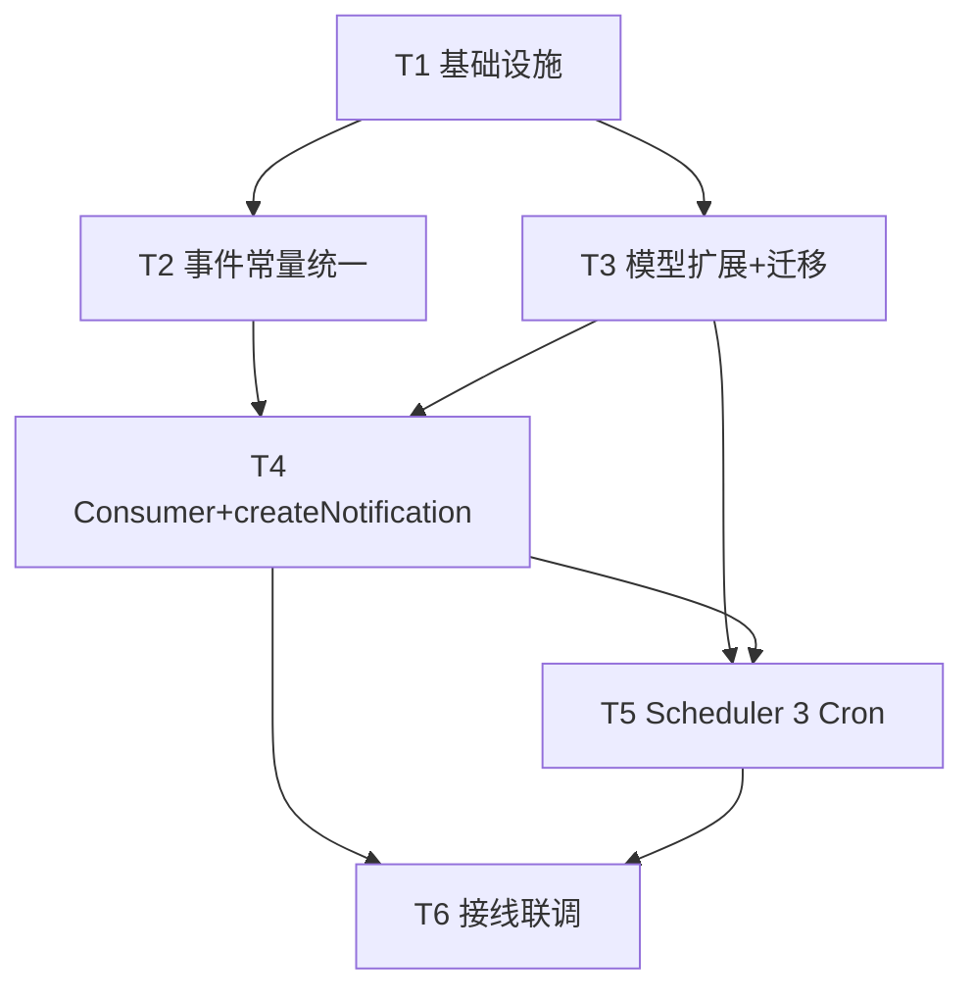

# 智医助手 · 事件总线订阅 + Scheduler 定时任务 修复设计方案

> **根因**：事件总线"发布-订阅"彻底断裂（P0）。全仓 15 处 `eventBus.publish(...)` **没有任何订阅者**，导致通知系统永不生成记录（PRD P0-04/P0-05），30 天复评提醒 / 漏服告警 / 连续异常预警全部静默。
> **范围**：仅做设计与任务分解，不写实现代码。所有证据来自实际读码（file:line）。

---

## 0. 证据摘要（来自实际代码）

### 0.1 发布机制已就绪，仅缺订阅者
- `src/shared/events/event-bus.service.ts:1-85`
  - `EventBusService` 封装 `@nestjs/event-emitter` 的 `EventEmitter2`（行 2、46）。
  - `publish()`（行 51-68）底层调用 `this.eventEmitter.emitAsync(eventType, event)`（行 67）——即把整个 `BaseEvent` 作为单一参数 emit。
  - `on()`（行 73-76）、`once()`（行 81-83）已定义但**全仓从未被调用**（见 0.3）。
- `src/shared/events/event-bus.module.ts:1-12`：`EventBusModule` 是 `@Global()`，导出 `EventBusService`，因此任何模块都能直接注入。
- `src/app.module.ts:43-50`：**已注册** `EventEmitterModule.forRoot({ wildcard:false, delimiter:'.', ... })`。
  - 结论：**`@OnEvent()` 装饰器可直接使用，无需再注册 `EventEmitterModule`**。

### 0.2 定时任务能力完全缺失
- `package.json:25-53` 依赖中**没有** `@nestjs/schedule`（`@nestjs/event-emitter@^3.0.1` 已在行 29）。
- 全仓 grep `@nestjs/schedule|ScheduleModule|SchedulerRegistry|@Cron` **零匹配** → 需新增依赖并注册 `ScheduleModule`。

### 0.3 订阅者为空（根因铁证）
- grep `@OnEvent|eventBus.on|eventBus.subscribe` 全仓**仅命中**无关文件：
  - `red-line-engine.module.ts:25 onModuleInit`
  - `prisma.service.ts:20 onModuleInit`
- **没有任何 `eventBus.on(...)` / `@OnEvent(...)` 订阅者**。

### 0.4 全部 15 个发布点（file:line + 事件名 + payload）

| # | 文件:行 | 事件名（实际 emit 字符串） | payload 字段（来源） |
|---|---------|--------------------------|----------------------|
| 1 | `assessment.service.ts:290` | `assessment.completed` | `{ assessmentId, memberId:session.memberId, familyId:session.familyId, totalScore }` |
| 2 | `family.service.ts:49` | `family.created` | `{ familyId:family.id, userId }` |
| 3 | `family.service.ts:108` | `family.updated` | `{ familyId, userId }` |
| 4 | `family.service.ts:173` | `family.member_added` | `{ familyId, memberId:member.id, userId }` |
| 5 | `family.service.ts:245` | `family.member_removed` | `{ familyId, memberId, userId }` |
| 6 | `health-record.service.ts:78` | `health_record.updated` | `{ memberId, userId }` |
| 7 | `health-record.service.ts:101` | `health_record.chronic_updated` | `{ memberId, userId, diseaseCount }` |
| 8 | `health-record.service.ts:128` | `health_record.allergies_updated` | `{ memberId, userId, allergyCount }` |
| 9 | `consultation.service.ts:94` | `consultation.redline.triggered` | `{ memberId:dto.memberId, familyId:dto.familyId, userId, category, severity }` |
| 10 | `consultation.service.ts:202` | `consultation.completed` | `{ consultationId, memberId:dto.memberId, familyId:dto.familyId, userId, sessionId, responseTimeMs, model }` |
| 11 | `metric.service.ts:199` | `metric.abnormal`（= `DomainEvents.METRIC_ABNORMAL`） | `{ familyId, metricType, value, status }` |
| 12 | `metric.service.ts:203` | `metric.recorded`（= `DomainEvents.METRIC_RECORDED`） | `{ familyId, metricType, value }` |
| 13 | `medication.service.ts:85` | `medication.plan.created`（= `DomainEvents.MEDICATION_PLAN_CREATED`） | `{ planId, memberId:dto.memberId, familyId, userId }` |
| 14 | `medication.service.ts:231` | `medication.taken`（= `DomainEvents.MEDICATION_TAKEN`） | `{ planId, memberId:plan.memberId, userId }` |
| 15 | `medication.service.ts:233` | `medication.missed`（= `DomainEvents.MEDICATION_MISSED`） | `{ planId, memberId:plan.memberId, userId }` |

> 注：团队 lead 预估"约 17 处"，实际 grep 命中 **15 处**（已逐行核对，无遗漏）。

### 0.5 事件名常量不一致（必须修复的隐患）
- `event-bus.service.ts:8-27` 定义了 `DomainEvents` 常量，但**大量发布点使用裸字符串且与常量不一致**：
  - 行 290 `assessment.completed`、行 49 `family.created`、行 108 `family.updated`、行 173 `family.member_added`、行 245 `family.member_removed`、行 78/101/128 `health_record.*` 全部是裸字符串，且**不在 `DomainEvents` 中**。
  - `DomainEvents` 中 `MEMBER_ADDED:'family.member.added'`（行 11）与实际上报的 `'family.member_added'`（点 vs 下划线）**不匹配**——若订阅者照 `DomainEvents.MEMBER_ADDED` 订阅会永远收不到。
  - `metric.service.ts:7` / `medication.service.ts` 正确 import 并使用了 `DomainEvents`。
- **结论**：订阅者必须匹配"实际上报字符串"。修复时统一为单一常量源（见 §2）。

---

## 1. 实现方案 + 框架选型决策

### 1.1 事件订阅：推荐 `@OnEvent()` 装饰器
- **选型**：使用 `@nestjs/event-emitter` 的 `@OnEvent(eventName)` 装饰器（provider 方法级），**而非** `EventBusService.on()` 手动注册。
- **理由**：
  1. `EventEmitterModule.forRoot()` 已在 `app.module.ts:43` 注册，`@OnEvent` 开箱即用，无需任何额外注册。
  2. 声明式、由 Nest 自动发现，避免 `onModuleInit` 里手写 `eventBus.on(...)` 的样板与漏注册风险。
  3. 订阅方法通过参数即可拿到 `BaseEvent`（`publish` 用 `emitAsync(eventType, event)` 单参 emit，监听器首参即 `event`）。
- **是否要补 `EventEmitterModule`？** 不需要。`event-bus.module.ts:7` 已 `imports:[EventEmitterModule]`，且 `app.module.ts:43` 已 `forRoot()`。
- **`EventBusService.on()` 的保留**：本次不删除（不影响），仅作为备用 API。

### 1.2 定时任务：新增 `@nestjs/schedule`
- **选型**：使用 `@nestjs/schedule` 的 `@Cron()`（基于 `cron` 库，底层 `SchedulerRegistry`）。
- **必须新增依赖**（见 §7），并在 `app.module.ts` 注册 `ScheduleModule.forRoot()`。
- 三个定时任务解决"30 天复评 / 漏服 / 连续异常"，因这些场景靠"扫描数据 + 时间窗口"触发，事件总线无法覆盖（事件只在动作发生时触发，无法感知"过期未处理"）。

### 1.3 整体架构
```
发布方(各 domain service) ──eventBus.publish──▶ EventEmitter2(全局)
                                                    │
                       ┌────────────────────────────┼───────────────────────────┐
                       ▼                            ▼                           ▼
              NotificationConsumer            NotificationSchedulerService    (其他未来订阅者)
              (@OnEvent 即时通知)              (@Cron 扫描式通知)
                       │                            │
                       └──────────► NotificationService.createNotification() ──▶ Prisma notification.create
```
- **唯一写通知入口**：`NotificationService.createNotification()`（内部方法，不挂 controller），保证前端 GET 契约不变。

---

## 2. 事件名常量清单（单一事实源）

新建 `src/shared/events/events.constants.ts`，集中所有"实际上报字符串"，并**补全 `DomainEvents` 缺失项**，使裸字符串发布点改为引用常量：

```ts
// src/shared/events/events.constants.ts
export const EVENTS = {
  // —— 现有 DomainEvents 中已正确定义、且被引用 ——
  METRIC_ABNORMAL: 'metric.abnormal',
  METRIC_RECORDED: 'metric.recorded',
  MEDICATION_PLAN_CREATED: 'medication.plan.created',
  MEDICATION_TAKEN: 'medication.taken',
  MEDICATION_MISSED: 'medication.missed',

  // —— 补全：原裸字符串且不在 DomainEvents ——
  ASSESSMENT_COMPLETED: 'assessment.completed',
  FAMILY_CREATED: 'family.created',
  FAMILY_UPDATED: 'family.updated',
  FAMILY_MEMBER_ADDED: 'family.member_added',     // 注意：原为 family.member_added（下划线），不是 family.member.added
  FAMILY_MEMBER_REMOVED: 'family.member_removed',
  HEALTH_RECORD_UPDATED: 'health_record.updated',
  HEALTH_RECORD_CHRONIC_UPDATED: 'health_record.chronic_updated',
  HEALTH_RECORD_ALLERGIES_UPDATED: 'health_record.allergies_updated',
  CONSULTATION_REDLINE_TRIGGERED: 'consultation.redline.triggered',
  CONSULTATION_COMPLETED: 'consultation.completed',
} as const;
```

**每个事件名 → payload 字段映射**（供订阅者取数）：

| 事件名 | payload 字段 | 取数说明 |
|--------|-------------|---------|
| `medication.missed` | `planId, memberId, userId` | memberId→FamilyMember 取 `userId`/`familyId`；planId→MedicationPlan 取药名 |
| `consultation.redline.triggered` | `memberId, familyId, userId, category, severity` | 通知 family 创建者（照护人）+ actor |
| `medication.plan.created` | `planId, memberId, familyId, userId` | 可选欢迎提醒 |
| `family.member_added` | `familyId, memberId, userId` | 可选系统通知 |
| `assessment.completed` | `assessmentId, memberId, familyId, totalScore` | 本次不即时通知（复评提醒交给 cron） |
| 其余 `family.*` / `health_record.*` / `consultation.completed` / `metric.*` | 见 §0.4 | 本次**不订阅**（保持静默或后续扩展） |

---

## 3. NotificationConsumer 设计（核心修复）

### 3.1 位置与形态
- 新建 `src/modules/notification/notification.consumer.ts`，作为 `NotificationModule` 的 provider（无 controller）。
- 用 `@OnEvent()` 声明订阅；方法首参接收 `BaseEvent`，经 `event.payload` 取数。

### 3.2 订阅矩阵（事件 → 通知记录）

| 订阅事件 | type | title | body（模板） | userId 来源 | familyId 来源 | actionUrl |
|---------|------|-------|-------------|------------|-------------|-----------|
| `medication.missed` | `missed_dose` | 用药提醒：{药名} 未确认 | "{成员} 在 {时间} 的 {药名} {剂量} 尚未确认服用，请尽快处理。" | `resolveRecipient(memberId).userId` | 同上 `.familyId` | `/medication/{planId}` |
| `consultation.redline.triggered` | `system`（或 `red_line`） | 就医红线预警 | "家庭成员咨询触发就医红线（{category}/{severity}），请立即关注并就医。" | `Family.createdBy`（照护人）+ `userId`（本人） | payload.familyId | `/consultation/{consultationId}` |
| `medication.plan.created`（可选） | `medication_reminder` | 用药计划已创建 | "已为您创建 {药名} 用药计划，记得按时服药。" | payload.userId | payload.familyId | `/medication/{planId}` |
| `family.member_added`（可选） | `system` | 新成员加入家庭 | "{昵称} 已加入您的家庭。" | payload.userId | payload.familyId | `/family/{familyId}` |

> `resolveRecipient(memberId)` 约定：查 `FamilyMember`，返回 `{ userId: member.userId, familyId: member.familyId }`；若 `member.userId` 为空（未注册成员），回退到 `Family.createdBy`。

### 3.3 Notification 模型是否需要新增字段？
**结论：Notification 模型本次无需新增字段**（好消息，降低迁移风险）：
- `familyId String?` —— **已存在**（`schema.prisma:341`）
- `type String` —— **已存在**（`:343`，示例含 `missed_dose`/`metric_alert`/`assessment_review`/`system`）
- `actionUrl String?` —— **已存在**（`:346`，即"链接"字段，无需新增 `link`）
- `title` / `body` / `status` / `channel` —— 均已存在

**本次仅需在两个关联模型上新增去重/计数字段**（见 §4.3 与文件清单）：
```prisma
model Assessment {
  // ... 现有字段 ...
+ reviewNotified   Boolean  @default(false)   // cron1 复评提醒去重
  @@index([nextReviewAt, reviewNotified])
}

model HealthMetric {
  // ... 现有字段 ...
+ abnormalStreak   Int     @default(0)        // 连续异常计数（由 metric.service 维护）
+ abnormalAlerted  Boolean @default(false)    // cron3 连续异常预警去重
  @@index([memberId, metricType, abnormalAlerted])
}
```

### 3.4 写库方式（关键：不破坏现有 API）
- 在 `NotificationService` 新增**内部方法** `createNotification(input)`（不挂任何路由）：
  ```ts
  // 仅签名，不写实现
  createNotification(input: {
    userId: string;
    familyId?: string;
    type: 'medication_reminder' | 'missed_dose' | 'metric_alert' | 'assessment_review' | 'system';
    title: string;
    body?: string;
    actionUrl?: string;
    channel?: string;   // P0 内部通知默认 'in_app'
    status?: string;    // 默认 'pending'
  }): Promise<Notification>
  ```
- 内部 `this.prisma.notification.create({ data: {...} })`。
- **前端既有契约保持不变**：`GET /notifications`、`GET /unread-count`、`POST /:id/read`、`POST /read-all`、`DELETE /:id`（见 `notification.controller.ts:11-55`）全部不改。
- `dto/` 当前为空（`notification/dto` 目录无文件），新增内部 DTO `create-notification.dto.ts` 仅用于方法参数约束，不暴露为 API。

---

## 4. Scheduler 定时任务设计（解决 30 天复评 / 漏服 / 连续异常）

新建 `src/modules/notification/notification-scheduler.service.ts`（provider，无 controller），用 `@Cron()`。

### 4.1 Cron ① 30 天复评提醒
- **表达式**：`CronExpression.EVERY_DAY_AT_9AM`（或 `'0 0 9 * * *'`），`timeZone:'Asia/Shanghai'`。
- **扫描**：`Assessment` 中 `nextReviewAt <= now` 且 `status='completed'` 且 `reviewNotified=false`。
- **生成通知**：`type:'assessment_review'`，title "健康自评复评提醒"，body "您上次自评已满 30 天，建议尽快进行复评。"，`actionUrl:'/assessment'`，recipient=`resolveRecipient(memberId)`。
- **去重**：写库后 `Assessment.update({ reviewNotified:true })`。
- **新增查询方法**：`AssessmentService.findDueReviews()`（在 `assessment.service.ts` 新增，返回待提醒列表）。

### 4.2 Cron ② 漏服（>30 分钟）告警
- **表达式**：`'0 */15 * * * *'`（每 15 分钟），`timeZone:'Asia/Shanghai'`。
- **扫描**：`MedicationAdherence` 中 `status='pending'` 且 `scheduledAt < now-30min` 且 `missedNotified=false`。
- **生成通知**：`type:'missed_dose'`，title "用药提醒：{药名} 已漏服"，body "您计划在 {时间} 服用的 {药名} {剂量} 已超过 30 分钟未确认，请尽快处理。"（药名由 `planId→MedicationPlan` 取），`actionUrl:'/medication/{planId}'`，recipient=`plan.memberId→resolveRecipient`。
- **去重**：复用既有字段 `missedNotified`/`missedNotifiedAt`（`schema.prisma:282-283` 已存在），写库后 `update({ missedNotified:true, missedNotifiedAt:now })`。
- **新增查询方法**：`MedicationService.findOverdueAdherences()`（在 `medication.service.ts` 新增）。

### 4.3 Cron ③ 连续异常预警
- **表达式**：`'0 30 8 * * *'`（每日 08:30），`timeZone:'Asia/Shanghai'`。
- **背景（重要分歧，见 §8）**：PRD/任务假定 `Metric` 有 `alertConsecutiveCount` 字段，但**实际 schema 无此计数列**。`HealthMetric`（`:298-321`）仅存 `value/metricType/recordedAt/memberId`，**无 familyId、无 isAbnormal、无计数**；`alertConsecutiveCount` 实际位于 `MetricThreshold`（`:323-332`）作为**阈值配置**（默认 3）。因此"连续异常"必须**实时计算**，不能读字段。
- **方案**：在 `metric.service.ts` 的 `afterRecord()`（`:193`，于 `record():68` / `recordBatch():98` 调用后）维护 `HealthMetric.abnormalStreak`（异常 +1，正常归 0）与 `abnormalAlerted`。Cron ③ 扫描 `HealthMetric` 中 `abnormalStreak >= MetricThreshold.alertConsecutiveCount` 且 `abnormalAlerted=false` 的最新记录，按 `(memberId, metricType)` 分组。
- **生成通知**：`type:'metric_alert'`，title "健康指标连续异常预警"，body "{metricType} 连续 {streak} 次超出正常范围，请关注。"，`actionUrl:'/metrics/{memberId}'`，recipient=`resolveRecipient(memberId)`（familyId 由 member→family 取）。
- **去重**：写库后 `HealthMetric.update({ abnormalAlerted:true })`（该 episode 后续不会再触发，直到出现正常读数使 streak 归 0）。
- **新增查询方法**：`MetricService.findConsecutiveAbnormal()`（在 `metric.service.ts` 新增）；`afterRecord()` 改造（同文件）维护 streak。

### 4.4 三个 Cron 的依赖与去重总览
| Cron | 扫描表 | 去重字段 | 新增查询方法位置 | 依赖的 schema 改动 |
|------|--------|---------|----------------|------------------|
| ① 复评 | `Assessment` | `reviewNotified`（新增） | `assessment.service.ts` | §3.3 Assessment |
| ② 漏服 | `MedicationAdherence` | `missedNotified`（已有） | `medication.service.ts` | 无 |
| ③ 连续异常 | `HealthMetric` | `abnormalAlerted`（新增）+ `abnormalStreak`（新增） | `metric.service.ts` | §3.3 HealthMetric |

---

## 5. 文件清单（相对 `src/`，区分新增/修改）

### 新增
1. `src/shared/events/events.constants.ts` —— 单一事件名常量源（§2）
2. `src/modules/notification/notification.consumer.ts` —— `@OnEvent` 即时通知订阅者（§3）
3. `src/modules/notification/notification-scheduler.service.ts` —— 3 个 `@Cron` 定时任务（§4）
4. `src/modules/notification/dto/create-notification.dto.ts` —— 内部 `createNotification` 参数 DTO（不暴露 API）

### 修改
5. `package.json` —— 新增 `@nestjs/schedule`、`@types/cron`（§7）
6. `src/app.module.ts` —— `imports` 增加 `ScheduleModule.forRoot()`（行 31 区域；`EventEmitterModule` 已存在无需动）
7. `src/shared/events/event-bus.service.ts` —— `DomainEvents` 补全缺失项（或直接改用 `events.constants.ts` 并 re-export）
8. `src/modules/family/family.service.ts` —— 行 49/108/173/245 裸字符串改引用 `EVENTS.*`
9. `src/modules/health-record/health-record.service.ts` —— 行 78/101/128 裸字符串改引用 `EVENTS.*`
10. `src/modules/assessment/assessment.service.ts` —— 行 290 裸字符串改引用 `EVENTS.*`
11. `src/modules/consultation/consultation.service.ts` —— 行 94/202 裸字符串改引用 `EVENTS.*`
12. `src/modules/notification/notification.service.ts` —— 新增 `createNotification()` 内部方法（§3.4）
13. `src/modules/notification/notification.module.ts` —— `imports:[ScheduleModule]`、`providers` 增加 Consumer + SchedulerService
14. `src/modules/metric/metric.service.ts` —— `afterRecord()` 维护 `abnormalStreak`/`abnormalAlerted`；新增 `findConsecutiveAbnormal()`
15. `src/modules/assessment/assessment.service.ts` —— 新增 `findDueReviews()`
16. `src/modules/medication/medication.service.ts` —— 新增 `findOverdueAdherences()`
17. `prisma/schema.prisma` —— `Assessment.reviewNotified`、`HealthMetric.abnormalStreak`/`abnormalAlerted`（§3.3）+ 生成迁移

---

## 6. 任务列表（有序、含依赖、按实现顺序）

> 说明：本修复为后端 NestJS 项目，按团队 lead 指定的 6 步顺序组织（覆盖了通用"≤5 任务"模板在本场景下的等价拆分：T1=基础设施、T2=常量、T3=模型、T4=订阅者、T5=cron、T6=接线联调）。

- **T1 · 基础设施（依赖 + 注册 ScheduleModule）** — P0
  - 文件：`package.json`、`src/app.module.ts`
  - 依赖：无
  - 内容：`npm i @nestjs/schedule @types/cron`；`app.module.ts` 增加 `ScheduleModule.forRoot()`（`EventEmitterModule` 已注册，不动）。

- **T2 · 事件常量统一 + 发布点整改** — P1
  - 文件：`src/shared/events/events.constants.ts`（新）、`src/shared/events/event-bus.service.ts`、`family.service.ts`、`health-record.service.ts`、`assessment.service.ts`、`consultation.service.ts`
  - 依赖：T1
  - 内容：建立 `EVENTS` 单一常量源；把 5 个文件的裸字符串发布点改为引用常量（消除 §0.5 不一致，确保订阅者字符串可匹配）。

- **T3 · Notification 关联模型扩展 + 迁移** — P0
  - 文件：`prisma/schema.prisma`、生成迁移文件
  - 依赖：无（与 T1/T2 可并行）
  - 内容：`Assessment.reviewNotified`、`HealthMetric.abnormalStreak`/`abnormalAlerted`（§3.3）；`prisma migrate dev` 生成迁移。**Notification 模型本身不改。**

- **T4 · createNotification + NotificationConsumer** — P0
  - 文件：`notification.service.ts`、`notification.consumer.ts`（新）、`dto/create-notification.dto.ts`（新）
  - 依赖：T2、T3
  - 内容：`NotificationService.createNotification()` 内部方法；`NotificationConsumer` 用 `@OnEvent` 订阅 `medication.missed` / `consultation.redline.triggered`（+ 可选 `medication.plan.created` / `family.member_added`），经 `createNotification` 写库。

- **T5 · NotificationSchedulerService（3 个 Cron）** — P0
  - 文件：`notification-scheduler.service.ts`（新）、`metric.service.ts`（维护 streak）、`assessment.service.ts`（findDueReviews）、`medication.service.ts`（findOverdueAdherences）
  - 依赖：T3、T4
  - 内容：3 个 `@Cron`（§4）；`metric.service.afterRecord` 维护 `abnormalStreak`；各 service 新增扫描查询方法。

- **T6 · 接线与联调** — P0
  - 文件：`notification.module.ts`、`app.module.ts`（验证）、集成自测
  - 依赖：T4、T5
  - 内容：`NotificationModule` 增加 `imports:[ScheduleModule]` 与 `providers:[NotificationConsumer, NotificationSchedulerService]`；启动后验证 15 个事件有订阅、3 个 cron 注册成功、前端 `GET /notifications` 能看到新通知且不破坏既有字段。

### 任务依赖图


---

## 7. 依赖包清单（需 `npm i`）
```
@nestjs/schedule@^11.0.0   # 定时任务（@Cron / SchedulerRegistry），当前 package.json 缺失
@types/cron@^2.0.0         # cron 表达式类型（CronExpression 由 @nestjs/schedule 自带，可选）
```
> 已有无需新增：`@nestjs/event-emitter@^3.0.1`（事件订阅）、`@prisma/client@^6.17.0`、`uuid`（事件 id）。
> 安装后执行 `npx prisma migrate dev --name add_notification_scheduler_fields` 生成迁移。

---

## 8. 共享约定 / 待明确事项

1. **事件常量位置**：统一放 `src/shared/events/events.constants.ts`（`EVENTS`），发布方与订阅方都从同一文件 import，避免再出现"点 vs 下划线"错配。
2. **Notification.type 枚举值约定**：沿用模型注释已有词汇 `medication_reminder` / `missed_dose` / `metric_alert` / `assessment_review` / `system`；红线预警若产品希望独立区分，可新增 `red_line`（DB 中 `type` 为自由 String，无约束，可直接用）。
3. **channel 约定**：P0 内部通知建议 `channel:'in_app'`（模型默认 `'wechat_subscribe'` 是给未来微信订阅推送用的，本次不改默认值语义，但写入时显式置 `'in_app'` 以示区别）。
4. **cron 时区**：`@Cron` 默认用服务器本地时区。本次统一显式传 `timeZone:'Asia/Shanghai'`，并在 `.env`/部署文档注明服务器时区假设（用户时区个性化推送为后续迭代）。
5. **recipient 解析规则**：含 `userId` 的事件优先用 `userId`；仅含 `memberId` 的经 `FamilyMember` 解析 `userId`/`familyId`；未注册成员回退 `Family.createdBy`。
6. **⚠️ 连续异常计数分歧（需决策）**：PRD/任务假设 `Metric` 有 `alertConsecutiveCount` 列，但实测 **`HealthMetric` 无此列、无 familyId、无 isAbnormal**，`alertConsecutiveCount` 仅存在于 `MetricThreshold` 作为阈值。本方案采用"在 `metric.service.afterRecord` 维护 `abnormalStreak` + cron 扫描"的务实做法（§4.3）。若团队倾向"纯 cron 计算、零 schema 改动"，则需 cron 内对每条 `(memberId,metricType)` 排序后数末尾连续异常并重新评估阈值——更复杂且需重复评估；本方案不推荐。
7. **幂等**：`medication.missed` 事件与 Cron② 可能针对同一剂量——以 `MedicationAdherence.missedNotified` 为幂等键，二者 whichever-first 写通知并置位，避免重复轰炸。

---

## 9. 安全 / 兼容提醒

- **不破坏现有 API 契约**：`notification.controller.ts` 的 5 个端点（list / unread-count / markRead / markAllRead / remove）**全部不改**；新增的 `createNotification()` 为 service 内部方法，不挂任何 `@Controller`/`@Route`。
- **新增能力不暴露为公开端点**：所有通知写入仅通过 `@OnEvent` 订阅者与 `@Cron` 定时任务内部调用 `NotificationService.createNotification()` 触发，无任何新增 HTTP 路由。
- **事件字符串必须严格一致**：订阅者 `@OnEvent` 的事件名必须与 §0.4 中"实际上报字符串"逐字匹配（这是本次根因的直接修复点）；T2 的常量统一是防回归的关键。
- **迁移安全**：新增字段均有 `@default`，为可加列、向后兼容；`prisma migrate dev` 在开发库执行，生产走 `migrate deploy`。Notification 主表结构不变，前端解析无影响。
- **幂等去重**：三个 cron 均带去重字段（§4.4），防止服务重启/重复调度导致通知轰炸。
