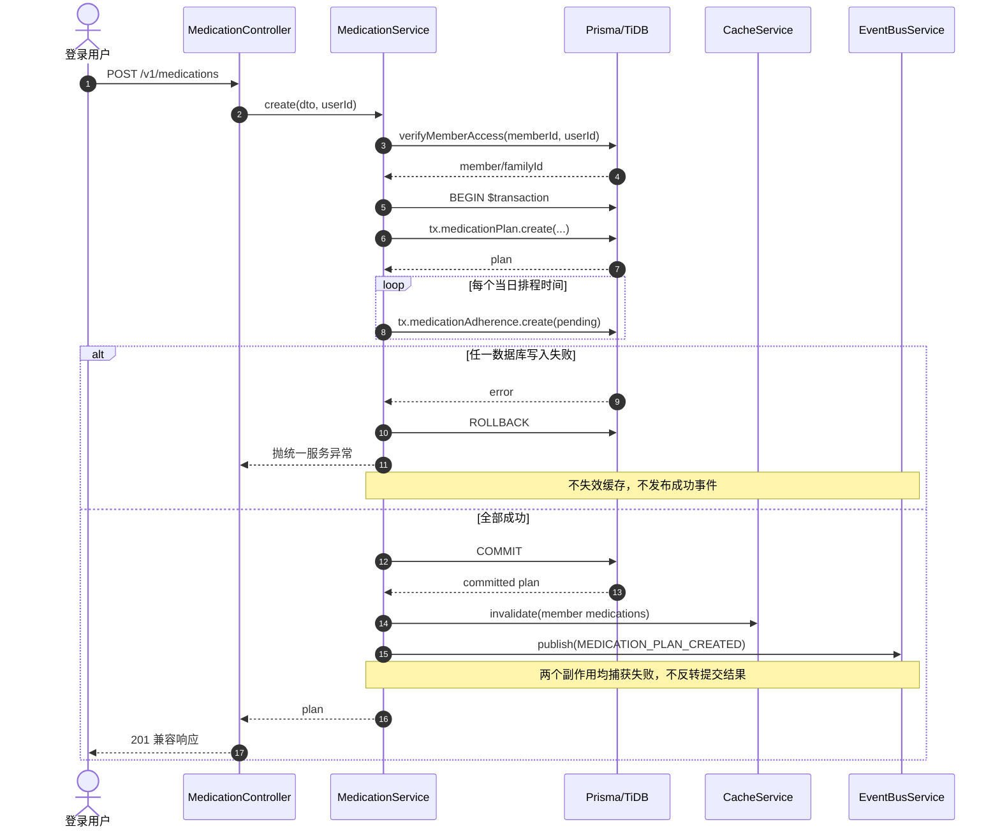
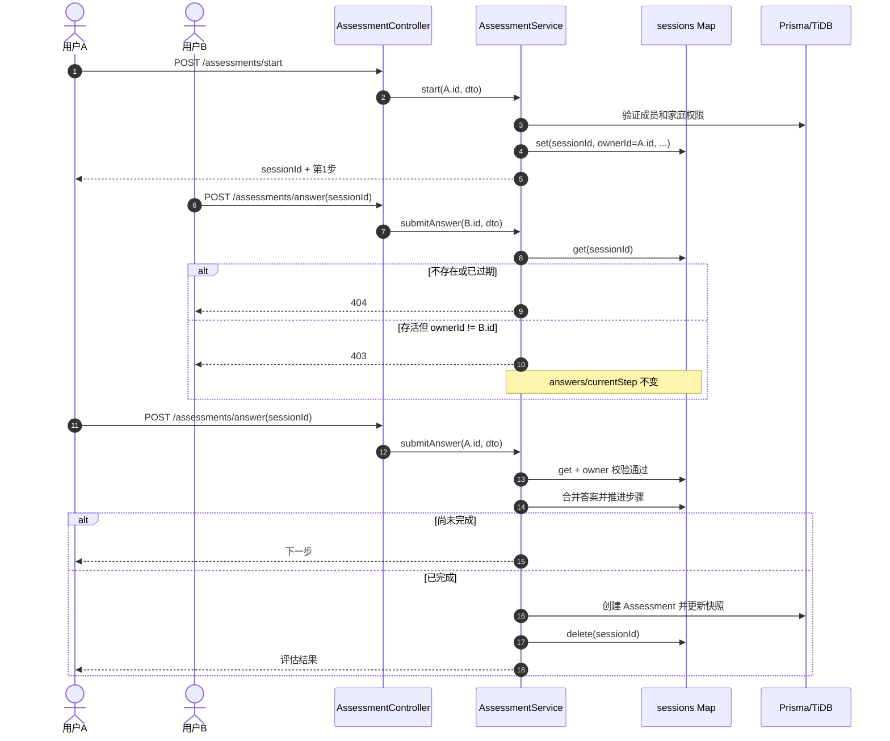
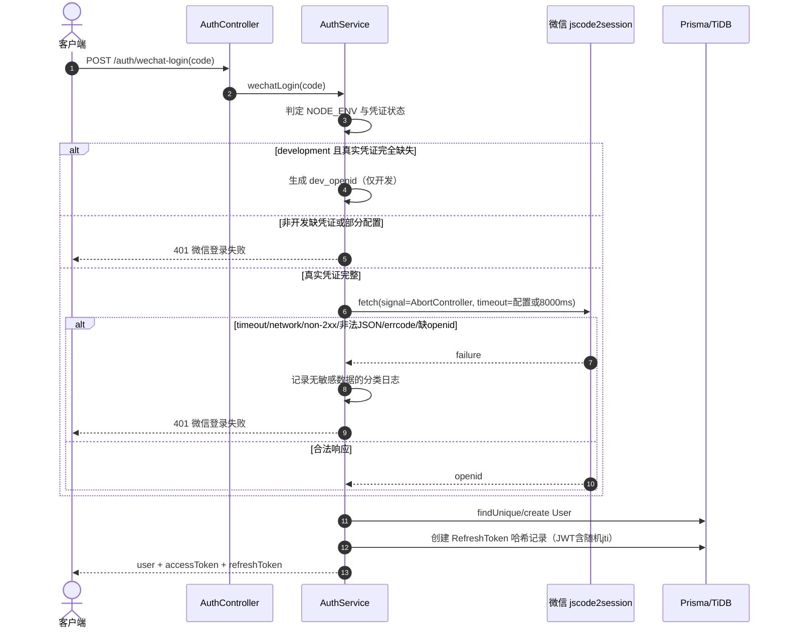
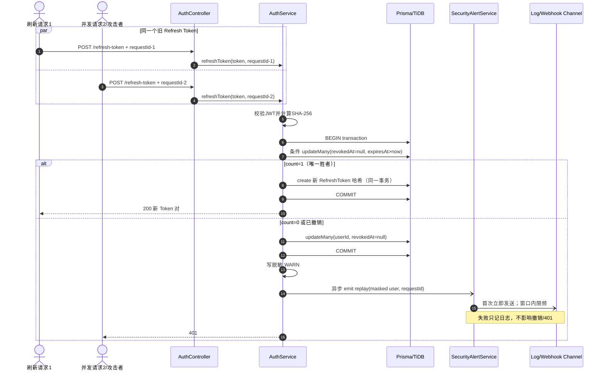
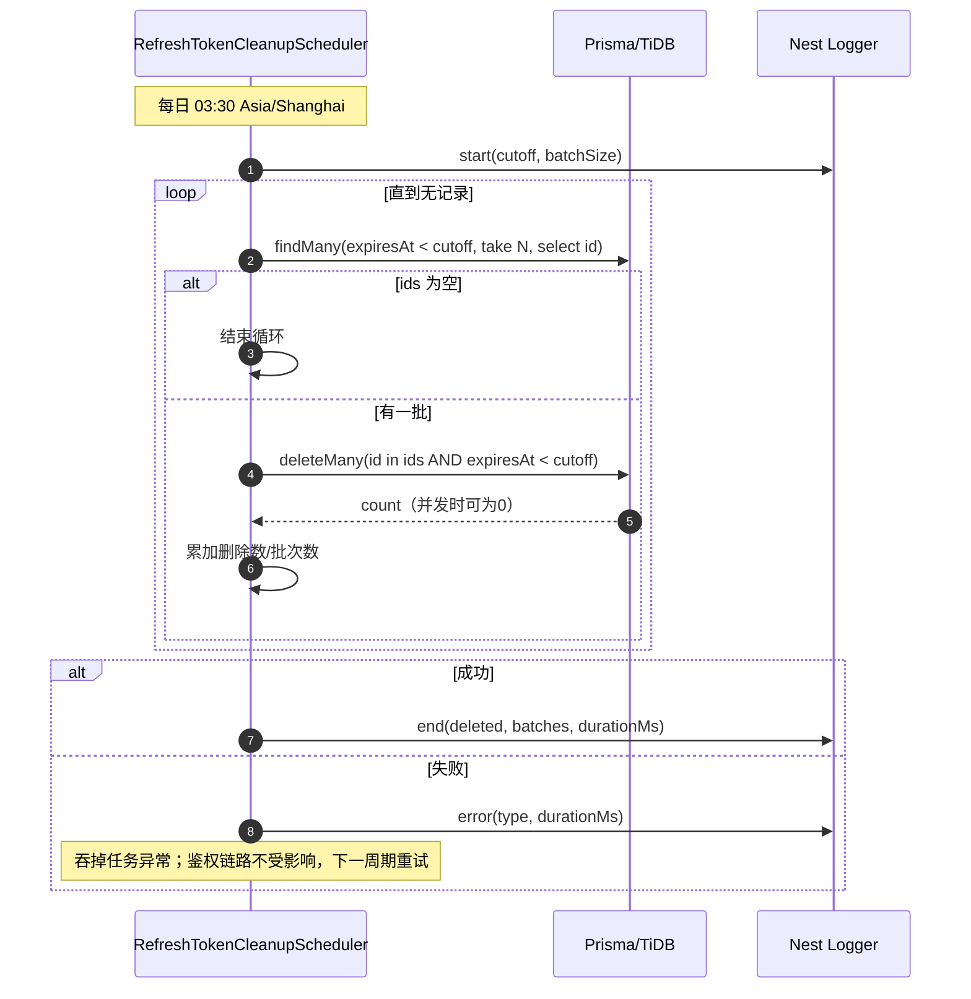
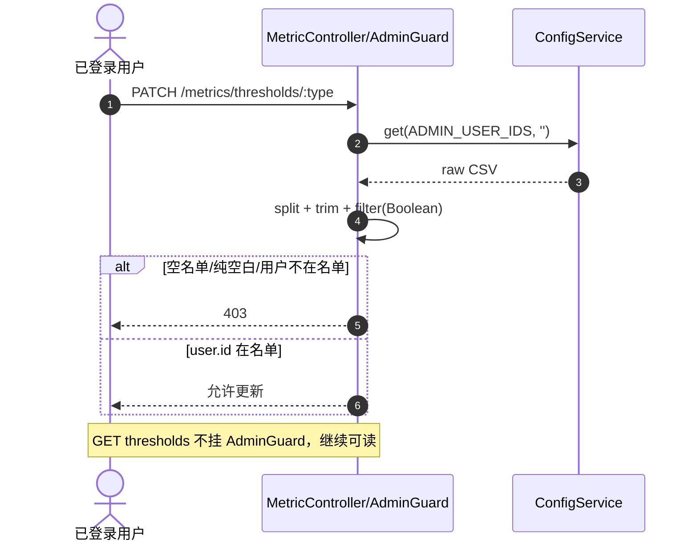
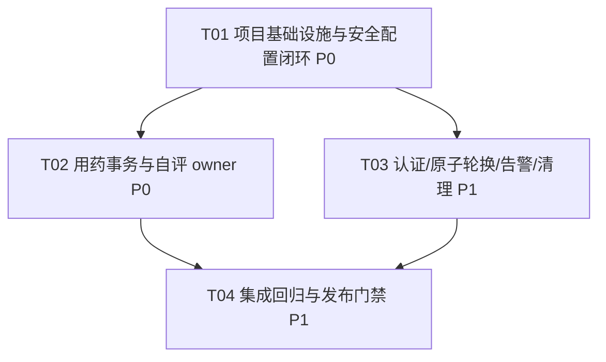

# 智医助手后端安全加固增量架构设计

- **项目范围**：`deliverables/backend/nestjs`
- **设计依据**：`docs/security-hardening-incremental-prd.md`
- **设计类型**：现有 NestJS + Prisma 单体应用的增量安全加固
- **不在本轮**：M3 字段类型迁移、M4 档案功能补全、自评会话 Redis 化、RBAC 管理后台、JWT/客户端协议变更

---

# Part A：系统设计

## 1. 实现方案

### 1.1 现状代码定位与问题判定

| 范围 | 现状位置 | 当前行为 | 判定 |
|---|---|---|---|
| 用药计划创建 | `src/modules/medication/medication.service.ts:58-89`，尤其 `create()` 的计划写入约在 62-79 行、`ensureTodayAdherences()` 调用约在 82 行 | 计划先写入，依从记录后逐条写入；没有事务 | P0，任一依从写入失败会遗留计划或部分依从记录 |
| 用药依从预生成 | 同文件 `ensureTodayAdherences()`，约 305-322 行 | 方法直接使用根 `PrismaService`，循环 `create` | 必须允许注入 `Prisma.TransactionClient`，才能进入与计划相同的事务 |
| 创建后副作用 | 同文件约 84-87 行 | 缓存失效和成功事件位于两次数据库操作之后，但数据库操作本身没有统一提交边界；事件 Promise 未等待/捕获 | 改为事务提交后执行；副作用失败只记日志，不得把已提交写入伪装成创建失败 |
| 管理员守卫 | `src/common/guards/admin.guard.ts:16-34` | `ADMIN_USER_IDS` 逗号拆分、trim、过滤空项；空名单或不匹配均 403 | deny-by-default 已正确，保留逻辑，仅补配置交付和回归测试 |
| Docker 管理员配置 | `../docker-compose.yml` 的 API `environment`，约 154-197 行 | 未透传 `ADMIN_USER_IDS` | P0，容器行为与直接启动不一致 |
| NestJS 本地配置 | `.env:64-65` | 已有 `ADMIN_USER_IDS=`，且注释说明空值无管理员 | 变量名正确；不得提交真实管理员 ID |
| 环境变量示例 | `../.env.example` 全文；项目内当前没有 `.env.example` | 根示例仍使用旧数据库/JWT/微信变量名，且没有 `ADMIN_USER_IDS`；`AppModule` 却会读取项目 cwd 下 `.env.example` | 新增 NestJS 级示例并同步根示例的安全变量；文档明确两种启动方式 |
| 自评内存会话 | `src/modules/assessment/assessment.service.ts:113-122` | `AssessmentSession` 无 `ownerId` | P1，会话 ID 泄露后可被其他登录用户提交 |
| 自评会话创建 | 同文件 `start()`，约 157-199 行；会话写入约 172-181 行 | 已验证发起人具有家庭成员访问权，但未把发起人绑定到会话 | 创建时写入 `ownerId: userId` |
| 自评会话读取/提交 | 同文件 `getSession()` 约 204-212 行；`submitAnswer()` 约 229-302 行 | 只检查存在/过期，之后立即修改答案和步骤 | `getSession(sessionId, userId)` 必须按“存在/过期 → owner”顺序校验；跨用户 403 且校验必须早于任何修改 |
| 微信登录 | `src/modules/auth/auth.service.ts:39-82` | 有真实凭证时调用失败仍降级为 `dev_openid_*`；日志包含 openid/错误原文 | P1，真实凭证路径必须 fail-closed；开发降级仅允许 `NODE_ENV=development` 且真实凭证完全缺失 |
| 微信 HTTP 请求 | 同文件 `getWxSession()` 约 88-99 行 | 原生 `fetch` 无超时、不检查 HTTP 状态/响应结构 | 使用 Node 22 原生 `fetch` + `AbortController`，默认 8000ms，严格校验响应 |
| Refresh Token 轮换 | 同文件 `refreshToken()` 约 111-165 行 | 先读取 `revokedAt`，再无条件 `update`，最后另行创建新 Token | 存在 TOCTOU：同一个旧 Token 并发刷新可能都成功；本轮应一并修复，见 1.6 |
| Refresh Token 重放 | 同文件约 141-149 行 | 先撤销用户全部有效 Token，再 401/WARN；WARN 包含完整 userId，无外部告警 | 保留“撤销先于 401”；改为脱敏 WARN，并在提交后异步发送安全事件 |
| Refresh Token 生成 | 同文件 `generateTokens()` 约 189-213 行 | JWT 与哈希记录分开封装；同用户同秒签发存在生成相同 JWT/哈希的可能 | Refresh JWT 加随机 `jti`；提供可接收事务客户端的签发/持久化内部方法 |
| Refresh Token 表 | `prisma/schema.prisma:47-60` | 有 `[userId, expiresAt]` 联合索引，无 `expiresAt` 首列索引 | 清理仅按 `expiresAt` 扫描，建议新增 `@@index([expiresAt])`，不改字段类型 |
| 调度基础设施 | `src/app.module.ts:4,53-54`；`src/modules/notification/notification-scheduler.service.ts` | 已全局启用 `ScheduleModule`，通知调度固定 `Asia/Shanghai` | 复用 `@nestjs/schedule`，但 Token 生命周期调度归属 `AuthModule`，不耦合通知模块 |
| 请求 ID | `src/common/interceptors/request-id.interceptor.ts:15-19`，`auth.controller.ts:20-25` | request 已有 `requestId`，但刷新控制器未传给服务 | 刷新接口把 requestId 显式传入，用于安全告警；告警侧截断/清洗不可信 header |
| 测试基础 | `package.json:14-17,55-77`；根目录 `test_h2_m6.py`、`e2e_extended.py` | Jest/ts-jest 已安装但没有项目测试配置和业务单测；现有 Python 回归为运行态测试 | 增加最小 Jest 配置与定向安全测试脚本，不新增包 |

> **额外部署风险（不纳入本轮业务改动，但需立即运维处置）**：`../docker-compose.yml` 和 NestJS `.env` 中存在硬编码或真实形态的数据库/Redis/MinIO/JWT 配置。本文不复制具体值。建议把真实凭证移出版本库并立即轮换，Compose 统一改为 `${VAR}` 注入；该动作应单独走凭证轮换流程，避免与代码发布互相阻塞。

### 1.2 核心技术挑战

1. **数据库提交与外部副作用的严格边界**：Prisma 交互式事务只包数据库写入；缓存和事件既不能提前，也不能因自身失败导致客户端误认为数据库回滚。
2. **Refresh Token 并发轮换**：必须用数据库条件更新完成原子“消费”；单纯事务包裹现有“先查后改”仍不足以消除并发竞态。
3. **重放处置顺序与非阻塞告警**：撤销必须持久化后才能返回 401；告警发送失败不能回滚撤销或拖慢鉴权。
4. **内存会话授权语义**：不存在/过期必须优先返回 404，只有仍存活且 owner 不一致的会话返回 403，且授权失败前不得修改对象。
5. **微信开发便利与生产安全的分界**：必须同时识别运行环境、占位符、部分配置和完整真实配置，避免生产静默进入开发登录。
6. **多实例幂等清理**：无分布式锁时允许重复触发，但每批删除条件必须重申 `expiresAt < now`，使并发执行只导致部分批次删除数为 0，不误删有效记录。

### 1.3 框架、库与模式选择

- **NestJS 11（保留）**：模块化单体；认证、用药、自评各自保持领域模块边界。
- **Prisma 6（保留）**：
  - 用药创建使用 `$transaction(async tx => ...)`。
  - Token 轮换使用交互式事务 + `updateMany({ revokedAt: null, expiresAt: { gt: now } })` 条件消费。
  - 清理使用 `findMany(take)` + 防御性 `deleteMany(id in batch AND expiresAt < now)`。
- **`@nestjs/schedule` 6（已安装）**：新增认证域调度器，Cron `0 30 3 * * *`，时区 `Asia/Shanghai`。
- **Node 22 原生 `fetch` / `AbortController`（已具备）**：微信请求和通用 Webhook 告警均无需引入 Axios。
- **Node `crypto`（已具备）**：Refresh JWT `jti`、用户标识 SHA-256 脱敏。
- **架构模式**：现有 Controller → Service → Prisma 的分层模式；安全告警使用 Strategy/Port 模式（`SecurityAlertChannel`），默认日志通道，可配置通用 Webhook 通道。
- **不引入消息队列/Outbox**：本轮最小实现允许告警/事件 best-effort。若未来要求跨进程可靠交付，再以 Outbox 独立迭代。

### 1.4 用药创建事务边界

`verifyMemberAccess()` 是只读授权检查，放在事务前，减少事务持有时间。随后：

```text
事务外：校验成员访问权、准备 familyId/排程数据
BEGIN
  1. 创建 MedicationPlan
  2. 使用同一个 tx 创建当日全部 MedicationAdherence(status=pending)
COMMIT
事务外：缓存失效（捕获异常）
事务外：发布 MEDICATION_PLAN_CREATED（await + 捕获异常，或 void + catch）
返回已提交 plan
```

设计约束：

- `ensureTodayAdherences(tx, planId, frequency, customSchedule)` 的第一个参数必须为 `Prisma.TransactionClient`，方法内禁止回退到 `this.prisma`。
- 保留当前响应对象和排程规则；本轮不顺带调整 `every_8h`、服务器本地日界线等业务语义。
- 任一计划/依从写入异常由 Prisma 自动回滚；全局异常过滤器返回统一错误，禁止拼接数据库原始 message。
- 缓存和事件只在 `$transaction` Promise 成功返回后执行。
- 事务提交后副作用失败：记录 planId/memberId（不含药品隐私详情）后仍返回创建成功，防止客户端重试制造重复计划。
- 当前没有可靠 Outbox，因此“提交成功但进程在事件发布前退出”仍可能丢事件，列为后续可靠事件迭代。

### 1.5 管理员配置闭环

统一变量名：`ADMIN_USER_IDS`。

- 直接启动：NestJS cwd 下 `.env` / 新增 `.env.example`。
- Docker Compose：`ADMIN_USER_IDS: ${ADMIN_USER_IDS:-}`，由 `deliverables/backend/.env`、Shell 或部署系统注入。
- 示例只能为空值或伪值说明，**不得**提交真实 ID。
- 多 ID 示例只写格式，例如 `user-id-a,user-id-b`；解析继续 trim 并过滤空项。
- ID 获取方式：管理员候选账号登录后调用 `GET /v1/users/me`，读取统一响应 `data.id`；不要使用微信 openid 代替内部 `user.id`。
- 修改后必须重启/滚动重启全部 API 实例。
- 启动日志仅输出 `adminAccessEnabled=true|false` 与 `adminCount=N`，不得输出名单。
- 配置缺失、空串、纯空白时继续拒绝所有阈值写操作；`GET /v1/metrics/thresholds` 不受影响。

### 1.6 Refresh Token 并发轮换：本轮一并修复

**结论：纳入本轮，不作为后置项。** 原因是它与重放检测使用同一方法、同一数据模型和同一测试夹具；不修会使“旧 Token 只能使用一次”的核心保证在并发下失效。修复不改变 API、JWT 有效期或客户端交互，范围可控。

推荐算法：

1. 验证 Refresh JWT 签名与 `sub`，计算哈希。
2. 进入交互式事务，按哈希查询记录，并校验 `stored.userId === sub`。
3. 已撤销记录：事务内 `updateMany({ userId, revokedAt: null })` 撤销全部，返回 `REPLAY` 结果；**不要在事务内抛 401**，否则撤销会被回滚。
4. 未撤销且未过期：执行条件消费：
   `updateMany({ id, userId, revokedAt: null, expiresAt: { gt: now } }, { revokedAt: now })`。
5. `count === 1`：在同一事务内签发带随机 `jti` 的新 Refresh JWT并创建哈希记录，返回 Token 对。
6. `count === 0`：说明被并发请求抢先消费或状态变化；事务内撤销该用户全部仍有效记录，返回 `REPLAY`。
7. 事务提交后，`REPLAY` 分支先写脱敏 WARN，再 fire-and-forget 调用告警服务，最后抛 401。
8. 对可重试事务冲突（Prisma `P2034`）最多做有限重试；重试仍不能让同一旧 Token 产生两个成功结果。测试必须证明并发请求成功数 `<= 1`。

安全侧取舍：如果并发来自同一合法客户端的重复请求，第二请求也会触发全量撤销，客户端需重新登录；这是轮换型 Token 在无法区分攻击者与重试者时的 fail-closed 行为。

### 1.7 安全告警最小实现

新增认证域内告警端口，不绑定企业微信/飞书/Sentry：

```ts
interface SecurityAlertEvent {
  eventType: 'REFRESH_TOKEN_REPLAY';
  environment: string;
  maskedUserId: string;       // sha256(userId).slice(0, 12)
  occurredAt: string;         // ISO 8601 UTC
  requestId: string;          // 清洗并截断
}

interface SecurityAlertChannel {
  send(event: SecurityAlertEvent): Promise<void>;
}
```

通道与配置：

- `SECURITY_ALERT_CHANNEL=log|webhook|disabled`；开发/测试默认 `log`。
- `webhook` 使用通用 JSON POST，URL 由 `SECURITY_ALERT_WEBHOOK_URL` 注入；不新增 SDK 或平台账号依赖。
- `SECURITY_ALERT_TIMEOUT_MS=3000`，发送超时只记 ERROR。
- `SECURITY_ALERT_RATE_LIMIT_SECONDS=300`；进程内按 `eventType + maskedUserId` 限频，首次立即发送，窗口内重复计数并抑制。
- `NODE_ENV=production` 时，发布门禁必须要求 `channel=webhook` 且 URL 非空；应用启动也输出不含 URL 的错误级配置提示。若团队决定不让应用启动失败，则必须由部署流水线做等价阻断，二者至少选一，不能只记日志后宣称生产闭环。
- 调用方使用 `void alert.emitReplay(...).catch(...)`；告警 Promise 不进入 Token 撤销事务，不影响 401。
- 日志、Webhook 均禁止 Token 原文/哈希、JWT payload、微信 code/session_key、AppSecret、完整用户 ID。
- 当前限频为单实例；多实例全局聚合需 Redis/告警平台支持，见待明确事项。

### 1.8 微信 jscode2session 失败关闭

配置：`WX_JSCODE2SESSION_TIMEOUT_MS=8000`，解析为整数并限制在合理区间（建议 1000-30000ms）。

凭证状态机：

| NODE_ENV | AppID/Secret | 行为 |
|---|---|---|
| `development` | 二者均缺失或均为明确占位值 | 允许 `dev_openid_*` |
| `development` | 仅配置一项 | 配置错误，拒绝登录 |
| 任意 | 二者均为真实非占位值 | 调微信；任意失败均 401，不降级 |
| 非 `development` | 缺失、占位或部分配置 | 拒绝登录，不允许开发模式 |

微信调用必须同时满足：HTTP `2xx`、JSON 可解析、`errcode` 不存在或为 0、`openid` 为非空字符串。超时、网络错误、非 2xx、非法 JSON、微信错误码、缺少 openid 都转换为统一 `UnauthorizedException('微信登录失败')`。日志只记录分类（timeout/network/http/upstream/invalid-response），不记录 URL、code、Secret、session_key、openid 或上游原始响应。

### 1.9 Refresh Token 过期清理

- 服务：`RefreshTokenCleanupScheduler`，归属 `AuthModule`。
- Cron：`0 30 3 * * *`，`timeZone: 'Asia/Shanghai'`。
- 固定一次任务的 `cutoff = new Date()`；所有批次都使用同一 cutoff，语义稳定。
- 批量查询：`where: { expiresAt: { lt: cutoff } }`，`orderBy: { expiresAt: 'asc' }`，`take: batchSize`，只选 id。
- 批量删除再次带 `expiresAt: { lt: cutoff }`，不能以 `revokedAt` 为条件；未过期的已撤销记录必须保留。
- 直到查询为空或最后一批不足 batchSize；多实例重叠时 delete count 可以为 0，继续安全退出。
- 日志：开始时间、结束时间、cutoff、删除总数、批次数、耗时、失败类型；不得记录哈希。
- 最外层捕获异常，不向调度框架抛出影响进程的未处理异常；下一自然周期重试。
- 新增 `expiresAt` 单列索引；只新增索引，不改字段类型。上线前对 TiDB 执行计划和在线 DDL 窗口做确认。

---

## 2. 文件清单

### 2.1 修改文件

| 文件 | 变更 |
|---|---|
| `package.json` | 增加 Jest 最小配置及 `test:security` 脚本；依赖版本不变 |
| `src/main.ts` | 输出脱敏管理员启用状态/数量；生产告警配置门禁或错误提示 |
| `src/common/guards/admin.guard.ts` | 保留 deny-by-default；如抽取 CSV 解析工具，仅做等价重构 |
| `src/modules/medication/medication.service.ts` | 用药计划与今日依从记录共用 Prisma 事务；提交后执行副作用 |
| `src/modules/assessment/assessment.service.ts` | `AssessmentSession.ownerId`，所有会话读取/提交做 owner 校验 |
| `src/modules/auth/auth.controller.ts` | 刷新接口传入 requestId |
| `src/modules/auth/auth.service.ts` | 微信超时/fail-closed；Token 原子轮换；重放后异步告警 |
| `src/modules/auth/auth.module.ts` | 注册安全告警服务与 Token 清理调度器 |
| `prisma/schema.prisma` | 为 RefreshToken 新增 `@@index([expiresAt])` |
| `../docker-compose.yml` | 透传管理员、微信超时、清理和安全告警配置；不得固化真实 ID |
| `../.env.example` | 增加当前变量名与安全配置示例，清理/标明旧变量差异 |
| `test_h2_m6.py` | 扩展管理员名单、轮换/重放回归，不输出 Token |
| `e2e_extended.py` | 扩展自评跨用户和微信开发模式边界回归（可测试环境执行） |

### 2.2 新增文件

| 文件 | 作用 |
|---|---|
| `.env.example` | NestJS 直接启动的无密钥示例，包含 `ADMIN_USER_IDS=` 等当前变量 |
| `docs/security-operations.md` | 管理员 ID 获取/多 ID/重启/空值语义、生产告警接入、清理观测说明 |
| `src/modules/auth/security-alert.types.ts` | `SecurityAlertEvent`、`SecurityAlertChannel` 等接口 |
| `src/modules/auth/security-alert.service.ts` | 日志/禁用/通用 Webhook 策略、脱敏、限频、非阻塞错误处理 |
| `src/modules/auth/refresh-token-cleanup.scheduler.ts` | 每日 03:30 分批删除过期 Token |
| `prisma/migrations/<timestamp>_add_refresh_token_expires_at_index/migration.sql` | `expiresAt` 单列索引迁移（按仓库迁移规范生成，禁止手写字段类型变更） |
| `test/security-hardening/admin.guard.spec.ts` | 空/空白/多 ID/名单内外守卫单测 |
| `test/security-hardening/medication-transaction.spec.ts` | 正常事务、N 条依从失败回滚、副作用提交后执行 |
| `test/security-hardening/assessment-session-owner.spec.ts` | owner 正常、跨用户 403 且不变更、过期/不存在 404 |
| `test/security-hardening/auth-security.spec.ts` | 微信超时/fail-closed、Token 并发轮换、重放处置与告警失败隔离 |
| `test/security-hardening/refresh-token-cleanup.spec.ts` | 仅删过期、保留未过期 revoked、重复/并发执行幂等、异常吞吐 |
| `test_security_hardening.py` | 运行态增量验收编排，覆盖关键 AC 并调用既有回归 |

### 2.3 明确不修改

- `prisma/schema.prisma` 中 M3 涉及的 `@db.VarChar(4000)` 字段类型。
- 健康档案 DTO/服务（M4）。
- 前端、JWT 响应字段、Refresh Token 默认 30 天有效期。
- `NotificationSchedulerService`：Token 清理不应继续扩大通知模块职责。

---

## 3. 数据结构与接口

### 3.1 类图

```mermaid
classDiagram
  class AssessmentSession {
    +string sessionId
    +string ownerId
    +string memberId
    +string familyId
    +string type
    +number currentStep
    +number totalSteps
    +Record~string, unknown~ answers
    +Date createdAt
  }

  class AssessmentService {
    -Map~string, AssessmentSession~ sessions
    -number SESSION_TTL_MS
    +__init__(PrismaService, CacheService, EventBusService)
    +start(userId: string, dto: StartAssessmentDto) Promise~AssessmentStepResponse~
    +submitAnswer(userId: string, dto: SubmitAnswerDto) Promise~AssessmentStepResponse|AssessmentResult~
    -getSession(sessionId: string, userId: string) AssessmentSession
    -pruneStaleSessions() void
  }

  class MedicationService {
    +__init__(PrismaService, CacheService, EventBusService)
    +create(dto: CreateMedicationDto, userId: string) Promise~MedicationPlan~
    -ensureTodayAdherences(tx: TransactionClient, planId: string, frequency: string, customSchedule?: ScheduleItem[]) Promise~void~
    -verifyMemberAccess(memberId: string, userId: string) Promise~FamilyMemberRef~
  }

  class AuthService {
    +__init__(PrismaService, JwtService, ConfigService, SecurityAlertService)
    +wechatLogin(code: string) Promise~AuthTokens~
    +refreshToken(token: string, requestId?: string) Promise~AuthTokens~
    +logout(userId: string, token: string) Promise~SuccessResponse~
    -getWxSession(code: string, appId: string, secret: string, timeoutMs: number) Promise~WxSessionResult~
    -rotateRefreshTokenAtomic(tokenHash: string, userId: string) Promise~RotationOutcome~
    -generateTokens(userId: string, tx?: TransactionClient) Promise~AuthTokens~
  }

  class RefreshTokenCleanupScheduler {
    -string TIMEZONE
    -number batchSize
    +__init__(PrismaService, ConfigService)
    +handleExpiredTokenCleanup() Promise~void~
    -deleteExpiredInBatches(cutoff: Date) Promise~CleanupResult~
  }

  class SecurityAlertEvent {
    +REFRESH_TOKEN_REPLAY eventType
    +string environment
    +string maskedUserId
    +string occurredAt
    +string requestId
  }

  class SecurityAlertChannel {
    <<interface>>
    +send(event: SecurityAlertEvent) Promise~void~
  }

  class SecurityAlertService {
    -Map~string, RateLimitState~ rateLimits
    +__init__(ConfigService)
    +emitRefreshTokenReplay(userId: string, requestId?: string) Promise~void~
    -maskUserId(userId: string) string
    -sanitizeRequestId(requestId?: string) string
    -resolveChannel() SecurityAlertChannel
  }

  class LogSecurityAlertChannel {
    +send(event: SecurityAlertEvent) Promise~void~
  }

  class WebhookSecurityAlertChannel {
    -string url
    -number timeoutMs
    +send(event: SecurityAlertEvent) Promise~void~
  }

  class AdminGuard {
    +__init__(ConfigService)
    +canActivate(context: ExecutionContext) boolean
  }

  class PrismaService {
    +$transaction(callback) Promise~T~
    +medicationPlan
    +medicationAdherence
    +refreshToken
  }

  class RefreshToken {
    +string id
    +string userId
    +string tokenHash
    +Date expiresAt
    +Date createdAt
    +Date? revokedAt
  }

  AssessmentService "1" o-- "0..*" AssessmentSession : owns in-memory
  AssessmentService --> PrismaService : persists completed assessment
  MedicationService --> PrismaService : transaction
  AuthService --> PrismaService : rotates tokens
  AuthService --> SecurityAlertService : emits replay alert
  RefreshTokenCleanupScheduler --> PrismaService : deletes expired
  PrismaService --> RefreshToken : manages
  SecurityAlertService --> SecurityAlertChannel : selects
  SecurityAlertChannel <|.. LogSecurityAlertChannel : implements
  SecurityAlertChannel <|.. WebhookSecurityAlertChannel : implements
```



### 3.2 对外 API 兼容性

| API | 变化 | 兼容性 |
|---|---|---|
| `POST /v1/medications` | 内部事务化；响应结构不变 | 向后兼容 |
| `POST /v1/assessments/start` | 服务端会话增加 ownerId，不返回 ownerId | 向后兼容 |
| `POST /v1/assessments/answer` | 存活的他人会话从可提交变为 403 | 安全收紧，符合需求 |
| `POST /v1/auth/wechat-login` | 生产缺凭证或微信失败不再开发降级 | 安全收紧；错误仍为统一 401 |
| `POST /v1/auth/refresh-token` | 并发只允许至多一个成功；requestId 仅内部传递 | 协议不变 |
| `POST /v1/auth/logout` | 无变化 | 向后兼容 |
| `GET/PATCH /v1/metrics/thresholds...` | 仅部署配置闭环，守卫语义不变 | 读兼容、写权限按名单 |

---

## 4. 程序调用流程













---

## 5. 测试策略

### 5.1 单元/集成测试重点

| 需求 | 测试 |
|---|---|
| 用药事务 | mock `$transaction` 并验证计划/全部依从使用同一 tx；第 N 条依从写入失败时事务拒绝，缓存和事件均未调用；成功时副作用发生在 transaction resolve 后 |
| 管理员 | 缺失、空串、纯空白、含空项、多 ID、名单内/外；无 `request.user.id`；确认查询路由不受守卫影响 |
| 自评 owner | start 写入 owner；A 正常提交；B 提交 A 的存活 session 得 403 且 answers/currentStep 深比较不变；随机/过期 ID 为 404 |
| 微信 | 8000ms 默认值、配置覆盖、Abort 超时、网络异常、非 2xx、非法 JSON、errcode、缺 openid；真实配置所有失败不产生用户；仅 development+缺凭证允许 dev 用户；日志不含敏感输入 |
| 原子轮换 | `Promise.allSettled` 同 Token 并发，成功数最多 1；旧 Token 变 revoked；新 Token 记录与旧 Token 撤销同事务；失败竞争者触发全量撤销与 401 |
| 重放告警 | 撤销提交后才调用；event 字段齐全且脱敏；首个立即发送；窗口内限频；Webhook timeout/500 不改变 401 或撤销结果 |
| 清理 | cutoff 前记录删除；等于/晚于 cutoff 保留；未过期 revoked 保留；重复执行第二次删除 0；两实例式并发不误删；一批异常被捕获并记录 |
| 索引 | Prisma generate/build 通过；迁移 SQL 仅新增 `expiresAt` 索引；对 TiDB `EXPLAIN` 确认清理查询使用索引 |

### 5.2 运行态验收与回归

1. `npm run build`：零 TypeScript 错误。
2. `npm run test:security -- --runInBand`：新增安全单测全部通过。
3. `python test_security_hardening.py`：覆盖 AC-01 至 AC-11 中可自动化部分。
4. `python test_h2_m6.py`：既有 H2/M6 六项回归，并新增并发/重放检查。
5. `python e2e_extended.py`、`python test_notifications.py`：业务/通知回归。
6. M2 报告摘要：确认慢病/过敏字段继续正确读取，仅回归不改代码。
7. Compose 验证两轮：
   - `ADMIN_USER_IDS=` 时任意用户写阈值 403，读 200；
   - 设置测试用户内部 ID 并重建 API 容器后，名单内写成功、名单外 403；测试值不得提交。
8. 日志扫描：不得出现 refresh token/哈希、微信 code/session_key/Secret、openid、完整管理员名单、完整安全告警 userId。

### 5.3 故障注入

- Prisma tx 第 N 次 adherence create 抛错。
- Webhook 连接拒绝、超时、HTTP 500。
- 微信 fetch 超时、DNS/网络错误、HTTP 500、200 非 JSON、200 缺 openid。
- 清理批次中途抛错，确认服务健康和刷新接口仍可用。
- 两个并发刷新请求使用同一个 Refresh Token，重复至少 50 轮验证无双成功。

---

## 6. 待明确事项与设计假设

1. **生产告警渠道**：尚未确定企业微信/飞书/Sentry/Alertmanager。本文假设先实现通用 JSON Webhook Port；发布前必须确定接收 URL、值班人、升级策略，并完成一次真实故障演练。
2. **生产门禁位置**：建议应用在 `NODE_ENV=production` 且告警未配置时 fail-fast。若运维不同意影响启动，则必须明确由哪条 CI/CD policy 阻断发布。
3. **多实例规模**：清理算法无需锁即可数据安全幂等，但安全告警 5 分钟限频仅进程内；若已有多实例，可能每实例各发一次。严格全局聚合需要 Redis 或告警平台，在确认拓扑后决定是否本轮追加。
4. **Token 撤销留存**：按 PRD 假设到 `expiresAt` 即可删除；如有更长审计留存要求，应另存不含 Token/哈希的安全审计事件，而不是延长凭据记录寿命。
5. **TiDB 迁移流程**：仓库当前未见既有 migration 目录。本文假设可建立 Prisma migration 基线；执行前需确认生产以 `prisma migrate deploy`、人工 SQL 还是 TiDB 变更平台为准。
6. **用药事件可靠性**：本轮只保证事件在提交后触发，不保证进程崩溃场景的必达。若“创建后通知绝不能丢”，需另立 Outbox 需求。
7. **微信超时**：默认 8000ms；允许环境配置，本文假设上下限 1-30 秒。若网关总超时更短，应将微信超时调到网关预算以内。
8. **服务器时区**：用药“今日”仍沿用当前进程本地时间；本轮不改变既有排程语义。生产容器时区若非 Asia/Shanghai，应另评估日界线一致性。
9. **凭证泄露处置**：检查发现部署文件存在硬编码/真实形态凭证；是否已泄露及轮换负责人需立即确认。本设计不记录原值，也不把大范围 secret 管理改造混入四个工程任务。

---

# Part B：任务拆解

## 7. 依赖包

### 7.1 已有并继续使用

- `@nestjs/common@^11.1.0`：服务、守卫、日志与异常。
- `@nestjs/config@^4.0.2`：安全配置读取。
- `@nestjs/jwt@^11.0.1`：Access/Refresh JWT。
- `@nestjs/schedule@^6.1.3`：03:30 定时清理。
- `@prisma/client@^6.17.0`：交互式事务、条件更新、批次删除。
- `uuid@^11.1.0`：现有请求 ID；Refresh JWT `jti` 也可直接使用 Node `crypto.randomUUID()`。
- `jest@^30.2.0`、`ts-jest@^29.3.4`、`@nestjs/testing@^11.1.0`：安全单元测试。
- Node 22 内建 `fetch`、`AbortController`、`crypto`：HTTP 超时、Webhook、哈希与随机 ID。

### 7.2 新增包

- **无**。不得为 HTTP 超时或通用 Webhook 额外引入 Axios/Sentry/平台 SDK。

---

## 8. 有序任务列表（不超过 5 项）

### T01：项目基础设施与安全配置交付闭环

- **Source Files**：
  - `package.json`
  - `src/main.ts`
  - `src/common/guards/admin.guard.ts`
  - `../docker-compose.yml`
  - `../.env.example`
  - `.env.example`（新增）
  - `docs/security-operations.md`（新增）
  - `test/security-hardening/admin.guard.spec.ts`（新增）
- **工作内容**：统一 `ADMIN_USER_IDS` 透传与说明；补微信/清理/告警示例变量；启动仅输出管理员数量；配置 Jest；管理员守卫等价回归。示例和日志均不得出现真实 ID/密钥。对现有硬编码凭证只提交轮换工单/说明，不在文档复制原值。
- **Dependencies**：无
- **Priority**：P0
- **完成标准**：直接启动和 Compose 使用同一变量名；空名单 deny-by-default；文档给出 `GET /v1/users/me` 获取 ID、多 ID、重启步骤；构建与守卫测试通过。

### T02：领域写入原子性与自评会话所有权

- **Source Files**：
  - `src/modules/medication/medication.service.ts`
  - `src/modules/assessment/assessment.service.ts`
  - `test/security-hardening/medication-transaction.spec.ts`（新增）
  - `test/security-hardening/assessment-session-owner.spec.ts`（新增）
- **工作内容**：用药创建改为同一 Prisma 交互式事务；`ensureTodayAdherences` 强制使用 tx；提交后才失效缓存/发布事件并隔离副作用失败。自评会话增加 ownerId，按 404→403 顺序校验，授权通过后才能修改。
- **Dependencies**：T01
- **Priority**：P0
- **完成标准**：AC-01~03、AC-07 通过；失败注入后无计划/依从残留且无成功副作用；跨用户提交不改变会话。

### T03：认证安全、原子轮换、告警与 Token 生命周期

- **Source Files**：
  - `src/modules/auth/auth.controller.ts`
  - `src/modules/auth/auth.service.ts`
  - `src/modules/auth/auth.module.ts`
  - `src/modules/auth/security-alert.types.ts`（新增）
  - `src/modules/auth/security-alert.service.ts`（新增）
  - `src/modules/auth/refresh-token-cleanup.scheduler.ts`（新增）
  - `prisma/schema.prisma`
  - `prisma/migrations/<timestamp>_add_refresh_token_expires_at_index/migration.sql`（新增）
  - `test/security-hardening/auth-security.spec.ts`（新增）
  - `test/security-hardening/refresh-token-cleanup.spec.ts`（新增）
- **工作内容**：微信 8 秒可配置超时和 fail-closed；Refresh Token 条件消费+同事务生成新记录，修并发双成功；重放仍先全量撤销，提交后脱敏 WARN/异步限频告警；每日 03:30 Asia/Shanghai 批量清理 `expiresAt < cutoff`；新增过期索引。
- **Dependencies**：T01
- **Priority**：P1
- **完成标准**：AC-08~11 通过；并发同 Token 成功数最多 1；告警失败不阻塞；未过期 revoked 不删除；迁移仅增加索引且 TiDB 执行计划可接受。

### T04：集成验收、回归与发布门禁

- **Source Files**：
  - `test_security_hardening.py`（新增）
  - `test_h2_m6.py`
  - `e2e_extended.py`
  - `test_notifications.py`
  - `docs/security-operations.md`
- **工作内容**：编排 AC-01~12；执行并发轮换、跨用户会话、Compose 管理员透传、微信失败、清理幂等和告警失败测试；回归 H2/M6、M2、登录/刷新/登出、阈值、用药、通知；扫描日志敏感信息；确认生产告警配置门禁。
- **Dependencies**：T02、T03
- **Priority**：P1
- **完成标准**：`npm run build`、安全单测和既有回归全部通过；无敏感日志；生产配置、迁移、回滚和告警演练获得发布签字。

---

## 9. 共享约定

- 所有 HTTP 成功响应继续使用现有 `{ success, data, meta }` 封装；异常由全局过滤器返回统一格式和 requestId。
- 认证身份一律取 `req.user.id`（内部 `user.id`），不得以 openid、请求体 userId 或管理员名单内容替代。
- 日期持久化使用 `Date`/数据库 DateTime；告警对外时间使用 ISO 8601 UTC；Cron 明确 `Asia/Shanghai`。
- 数据库事务内只执行数据库读写；缓存、事件、Webhook 等副作用不得进入事务。
- 事务内需要保留安全处置时，不得在处置提交前抛业务异常；先返回内部 outcome，提交后再抛 401。
- 日志允许资源 ID 用于定位业务写入，但安全事件中的用户 ID 必须脱敏；任何日志都不得出现 Token、Token 哈希、JWT payload、微信 code/session_key/Secret、完整管理员名单。
- 配置 CSV 统一 `split(',').map(trim).filter(Boolean)`；空配置永远不授予权限。
- 清理条件唯一为 `expiresAt < cutoff`，不能增加 `revokedAt` 条件，也不能删除未过期 revoked 记录。
- 异步告警失败不得影响鉴权；首次重放立即发送，相同用户/事件在窗口内限频。
- 不在本轮改变 API 路径、响应字段、Refresh Token 30 天默认值、用药排程规则或自评存储介质。

---

## 10. 任务依赖图



该拆分避免长线性依赖：T02 与 T03 在 T01 完成后可以并行，最后由 T04 汇总验收。
